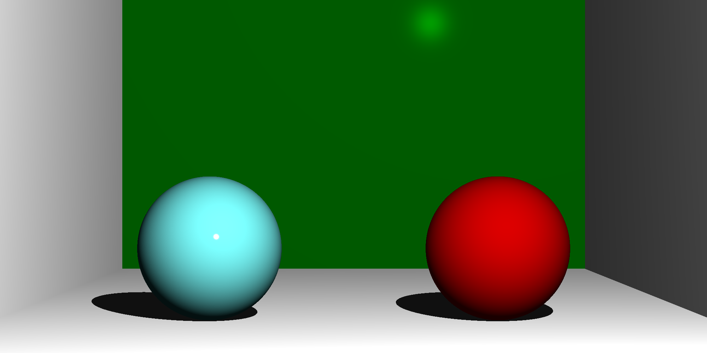

# go-ray-tracing
A simple ray tracer, written while I learn Go

This is a work in progress, and since starting work on this I've bought the test-driven "Ray Tracer Challenge" by Jamis Buck, so I plan to refactor the code to match that book.

I'm trying to keep track of progress images as I go along, of both mistakes and progress - you can find them in the `images` subdirectory.

## TODO

I've implemented basic shading with the Phong reflection model, shadows, spheres and planes so far. The code can produce images like this:


I expect visible progress to pause for a while as I refactor to match the ray tracer book.

## Quick Start

If you want to run the above image, simply install `go` and run
```
go run main.go
```

You should get an image at `./images/output.png`.

## Stuff I've Learnt

A collection of stuff I've picked up along the way. Will eventually be organsed in order from dumb -> interesting.

- Go doesn't have the functionality to run code at struct construction / initialisation (init in Python). It seems that the best way to get around this is by using a dedicated constructor function (e.g. MakeRay). Optionally, the class itself could be not exported, to enforce the usage of this function, but that then creates issues if you want to refer to that struct in e.g. func definitions.

- The Go `:= range` syntax is amazing, with the functionality of Python's `enumerate` in a more concise way.